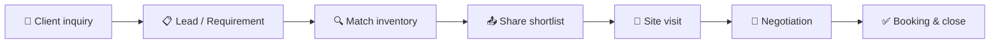
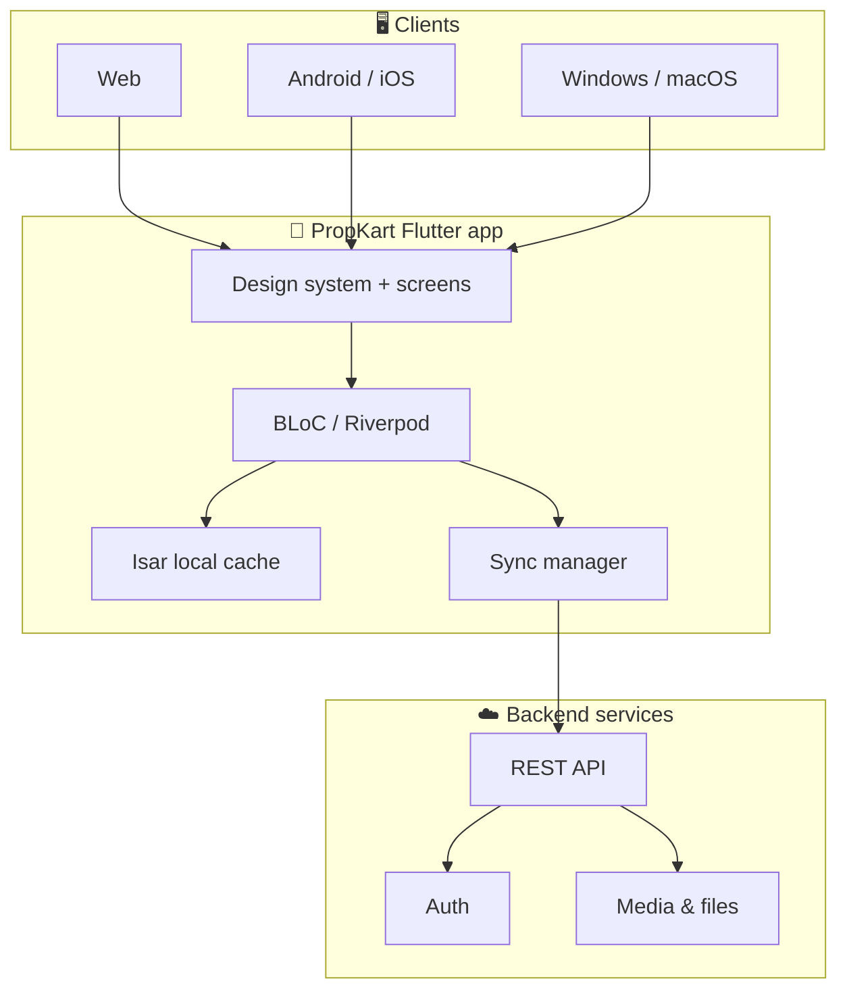

<div align="center">
  

  

  <h1>🏡 PropKart</h1>

  <p>
    
  </p>

  <p><strong>PropKart — The Future of Property Management.</strong></p>
  <p>A premium real-estate CRM built by <strong>NB Property Tech</strong> for brokers, sales teams, and agencies who manage rental and re-sale inventories at scale.</p>

  <p>
    <a href="https://propkart.nbpropertytech.com"></a>
    
    
  </p>

  <p>
    
    
    
    
    
    
    
    
    
    
  </p>
</div>

---

## ✨ Why PropKart?

PropKart is not a listing portal. It is the **operating system for a real-estate desk** — inventory, leads, matching, site visits, sharing, documents, campaigns, and team control in one Apple-inspired workspace.

| 🎯 For | 💡 What they get |
| --- | --- |
| **Brokers & agencies** | One inventory for Rent + Re-Sale, with verification, media, and owner records |
| **Sales & telecallers** | Lead pipelines, follow-ups, WhatsApp sharing, and property matching |
| **Admins** | Employees, campaigns, locations, recycle bin, and org settings |
| **Clients** | Beautiful public shortlists they can browse and reply to on WhatsApp |



---

## 🚀 Highlights

| | | |
| :---: | :---: | :---: |
| 🏠 **Unified inventory** | 🧭 **Smart matching** | 📤 **One-tap sharing** |
| Rent & Re-Sale, residential & commercial, photos, videos, maps | Budget, area, config, furnishing, facing | WhatsApp, public links, branded PDFs |
| 📊 **Live dashboard** | 📁 **Document library** | 📣 **Campaign inbox** |
| KPIs, trends, follow-ups, today's visits | Rental, Re-Sale, and vendor files | Meta Lead Ads + Google Sheets |
| 🌓 **Themes** | 📱 **Multi-platform** | 🔐 **Role-aware CRM** |
| Modern Teal & Classic Terracotta, light/dark | Android, iOS, Web, Windows, macOS | Super Admin, Admin, Sales, Telecaller |

---

## 🧩 Product modules

| Module | What it does | Who uses it |
| --- | --- | --- |
| 📊 **Dashboard** | Snapshot of inventory, leads, trends, today's site visits, follow-ups, notes, and recent listings | Everyone |
| 🏠 **Properties** | Full listing CRM: search, filters, compare, shortlist, archive, media, maps, owners | Sales + Admin |
| 🎯 **Leads / Requirements** | Buyer–tenant demand, matching, sharing, site visits, follow-ups, status board | Sales + Telecaller |
| 👥 **Employees** | Team directory, roles, photos, activity, password-reset requests | Admin + Super Admin |
| 📣 **Campaign** | Webhook inbox from Meta & Google Sheets, quality feedback, import to CRM | Admin + Super Admin |
| 📁 **Library** | Rental, Re-Sale, and Service Agent document vaults | Team |
| ⚙️ **Settings** | Profile, appearance, themes, locations, audit logs, about | Role-based |
| 🗑️ **Recycle Bin** | Restore deleted properties & requirements, auto-purge windows | Team |
| 👤 **Profile** | Name, mobile, photo, and personal account details | Everyone |
| 🏗️ **Builders** | Developer / builder partnerships and tiers | Team |
| 🏘️ **Owners** | Owner directory linked to their listings | Team |
| 🧍 **Clients** | Client records, sources, and pipeline stages | Team |

---

## 🏠 Properties

Manage every listing like a product catalog — not a spreadsheet.

| Capability | Details |
| --- | --- |
| 🏷️ Listing types | **Rent** and **Re-Sale** in one inventory, with a dedicated atmosphere per mode |
| 🏢 Categories | Residential & commercial, with configurations (BHK / RK and more) |
| 📍 Location | City, area, pincode, landmark, map pin, Google Place |
| 📐 Specs | Super built-up, carpet, plot, floor, age, bedrooms, bathrooms, balconies, parking |
| 💰 Commercials | Price, deposit, maintenance, brokerage, ownership, furnishing, facing |
| 🖼️ Media | Multiple photos, videos, amenities, and extra custom fields |
| ✅ Trust | Verified flag, property code, creator, timestamps |
| 🧰 Desk tools | Search, multi-filters, sort, pagination, **My added**, archive, no-images filter |
| ⚖️ Compare & shortlist | Side-by-side compare and shortlist for client conversations |
| 🗺️ Discovery | Public-style property search and rich detail pages |

**Typical listing fields**

| Group | Fields |
| --- | --- |
| Identity | Title, code, category, type, configuration, status |
| Place | City, area, pincode, address, landmark, lat/long |
| Size | Super built-up, carpet, plot, floor no., total floors |
| Money | Price, deposit, maintenance, brokerage |
| People | Owner name & mobile, broker name |
| Media | Images, videos, amenities |

---

## 🎯 Leads & matching

A requirement is a living deal — not a static form.

| Stage | Meaning |
| --- | --- |
| 🌱 Lead Created | Inquiry captured |
| 📝 Requirement Added | Budget, areas, config captured |
| ✅ Requirement Verified | Team confirmed the brief |
| 🔍 Matching Started | Inventory search begins |
| 🏡 Properties Matched | Suitable listings found |
| 📤 Properties Shared | Shortlist sent to client |
| 👀 Client Viewed | Client opened the share |
| 💛 Client Interested | Positive response |
| 📅 Site Visit Scheduled | Visit booked |
| 🚶 Site Visit Completed | Visit done |
| 💬 Negotiation | Terms in play |
| 🔑 Booking | Token / booking |
| 📄 Documentation | Papers in motion |
| 💸 Payment | Consideration flowing |
| 🚪 Possession | Handover |
| 🏁 Closed | Deal done |

**Lead tools**

- 📱 WhatsApp chat from the lead card
- 🔗 Public shortlist links clients can open on any device
- 📄 Branded multi-property PDF share
- 📅 Follow-up dates, re-followups, and site-visit statuses
- 🧠 Auto-match against inventory (budget, area, config, furnishing, facing)
- 🗂️ Statuses such as Active, Closed, Suspended, Follow-up, Site Visit, Not Interested

**Client sources**

| Source | Typical origin |
| --- | --- |
| 📞 Call | Inbound / outbound calling |
| 🤝 Referral | Existing network |
| 🌐 Website | Web inquiry |
| 📣 Ads | Paid campaigns |
| 💚 WhatsApp | Direct chat |

---

## 📊 Dashboard

The home screen of the desk.

| Widget | What you see |
| --- | --- |
| 👋 Welcome | Personalized greeting |
| 📈 KPIs | Total, available, sold, rented, requirements, users — with trends |
| 🏘️ Mix | Rental vs Re-Sale availability, rented / sold, won requirements |
| 🏆 Performance | Top broker, top area, top property, monthly growth |
| 📅 Today | Site-visit schedule |
| ⏰ Follow-ups | Today / due / future |
| 📝 Notes | Team checklist / notes |
| 🆕 Recent | Latest properties, with Rent / Re-Sale atmosphere |

---

## 📣 Campaigns & integrations

Connect paid and spreadsheet lead engines into the same CRM inbox.

| Connection | What it does |
| --- | --- |
| 📘 **Meta Lead Ads** | Facebook & Instagram lead forms flow into PropKart in real time |
| 🔁 **Meta quality loop** | Send lead-quality feedback back through Conversions API |
| 📑 **Google Sheets** | New rows from Forms or offline lists land as CRM leads |
| 🔎 **Google Ads** | Search & Display connector via the same inbound pipeline |
| 🧹 **Inbox tools** | Source filters, duplicate detection, search, bulk import, payload inspector |

> Campaign & integration screens are available to **Admin** and **Super Admin**.

---

## 📁 Document library

Keep deal paperwork next to the inventory — not in random WhatsApp chats.

| Library | Best for | Examples |
| --- | --- | --- |
| 🧾 **Rental** | Leasing & tenants | Lease agreements, ID proofs, rent & deposit receipts, utility bills, inspection media |
| 🤝 **Re-Sale** | Purchases & sales | Sale deeds, legal docs, society NOCs, floor plans, tax receipts, loan sanctions |
| 🛠️ **Service Agent** | Vendors & contractors | ID proofs, GST certificates, SLAs, price catalogs, invoices, completed-work showcase |

---

## 👥 Team, roles & access

Access is **role-aware** in the app. The server remains the source of truth.

| Role | Focus |
| --- | --- |
| 👑 **Super Admin** | Org control, Admin users, audit logs |
| 🛡️ **Admin** | Employees (Sales / Telecaller), campaigns, settings |
| 💼 **Sales** | Inventory, leads, matching, sharing, locations |
| ☎️ **Telecaller** | Lead capture, follow-ups, calling desk |

| Action | Super Admin | Admin | Sales | Telecaller |
| --- | --- | --- | --- | --- |
| Dashboard, properties, leads | ✅ | ✅ | ✅ | ✅ |
| Manage Sales / Telecaller | ✅ | ✅ | — | — |
| Manage Admin users | ✅ | — | — | — |
| Campaigns & webhooks | ✅ | ✅ | — | — |
| Audit logs | ✅ | — | — | — |
| Location lookups | ✅ | ✅ | ✅ | — |

---

## 🎨 Design system

Apple-inspired, not Apple-cloned. Built for long CRM sessions on laptop and phone.

| Token | Language |
| --- | --- |
| ✍️ Typography | SF Pro on Apple platforms, Inter elsewhere |
| 🎨 Color roles | Surface, glass, primary, success, warning, danger, charts |
| 📏 Spacing | 4 → 64 scale |
| 🟦 Radius | 4 → 40, plus pill |
| 🌫️ Glass | Backdrop blur on nav / overlays, not on long lists |
| 🎞️ Motion | 150 / 280 / 420 ms, springs, page fades |

**Themes**

| Theme | Vibe |
| --- | --- |
| 🟢 **Modern PropKart (Teal)** | Default SaaS teal, crisp whites, clean charts |
| 🧡 **PropKart Classic** | Warm terracotta, clay, charcoal, sage |

Light and dark modes persist per device. Rent vs Re-Sale can shift the atmosphere so the desk always knows which book it is working in.

**Responsive breakpoints**

| Device | Width |
| --- | --- |
| 📱 Phone | &lt; 768 |
| 💻 Tablet | 768 – 1023 |
| 🖥️ Desktop | ≥ 1024 |
| 📺 Wide / Ultrawide | 1280 / 1536 |

---

## 🛠️ Tech stack

| Layer | Choice |
| --- | --- |
| 💙 UI | Flutter (Material 3), custom CRM design system |
| 🧭 Routing | `go_router` |
| 🧠 State | `flutter_bloc` + `flutter_riverpod` |
| 🌐 HTTP | `dio` |
| 💾 Local cache | **Isar** for offline-friendly CRM data |
| 🔐 Secrets on device | `flutter_secure_storage` + `shared_preferences` |
| 🖼️ Media | Image picker, compression, cached network images, video player |
| 📄 Docs | `pdf`, share sheet, file picker |
| 🌍 Fonts | `google_fonts` |
| 🐛 Observability | Sentry |
| 📦 Version | `package_info_plus` + in-app update prompts |



---

## 📱 Platforms

| Platform | Status |
| --- | --- |
| 🌐 Web | Production app at [propkart.nbpropertytech.com](https://propkart.nbpropertytech.com) |
| 🤖 Android | Adaptive launcher icons, portrait-first CRM |
| 🍎 iOS | Native icons, SF Pro typography |
| 🪟 Windows | Desktop launcher icon |
| 🍏 macOS | Desktop launcher icon |

PWA-style web manifest ships with the web build (standalone display, themed chrome).

---

## 📂 Project map

```text
propkart/
├── lib/
│   ├── main.dart                 # App bootstrap
│   ├── splash.dart / get_started_screen.dart
│   ├── core/                     # Theme, API client, storage, security, design system
│   ├── features/                 # Dashboard, properties, leads, users, campaign, library…
│   └── modules/                  # Legal, version, remote config
├── assets/
│   ├── branding/                 # App icon, lockup, brand mark
│   └── legal/                    # Privacy & Terms
├── android/  ios/  web/  windows/  macos/
└── docs/                         # Design-system notes
```

---

## 🧑‍💻 Run locally

> This repository is the **Flutter client**. You need Flutter SDK **3.11+** (Dart `^3.11.1`) and a configured backend. Do not commit secrets, API keys, or environment files.

```bash
flutter pub get
flutter run
```

| Command | Purpose |
| --- | --- |
| `flutter run -d chrome` | Web |
| `flutter run -d windows` | Windows desktop |
| `flutter run` | Attached phone / emulator |
| `flutter analyze` | Static analysis |
| `flutter test` | Tests |

Launcher icons are generated from `assets/branding/app_icon.png` via `flutter_launcher_icons`.

---

## 🔒 Privacy & product principles

| Principle | In practice |
| --- | --- |
| 🛡️ Least privilege | Screens hide what a role should not see |
| 🔐 Device storage | Session material stays in secure storage |
| 🧾 Legal | In-app Terms and Privacy, with acceptance flow |
| 🗑️ Soft delete | Recycle bin before permanent purge |
| 📜 Audit | Super Admin can review sensitive activity |

- 📜 [Terms & Conditions](assets/legal/terms_v1.md)
- 🔏 [Privacy Policy](assets/legal/privacy_v1.md)

---

## 🏷️ Version

| Field | Value |
| --- | --- |
| App | **PropKart** |
| Version | **2.0.0** |
| Build | **8** |
| Package | `propkart` |
| Tagline | The Future of Property Management |

---

## 🌐 Links

| | |
| --- | --- |
| 🚀 Product | [propkart.nbpropertytech.com](https://propkart.nbpropertytech.com) |
| 🔑 Login | [propkart.nbpropertytech.com/login](https://propkart.nbpropertytech.com/login) |
| 👋 Get started | [propkart.nbpropertytech.com/get-started](https://propkart.nbpropertytech.com/get-started) |
| 🏢 Company | [NB Property Tech](https://propkart.nbpropertytech.com) |

---

<div align="center">
  <h3>🏡 Match. Share. Close.</h3>
  <p><em>Built for real-estate teams who live in inventory, not inboxes.</em></p>
  <p>
    <a href="https://propkart.nbpropertytech.com"><strong>Open PropKart →</strong></a>
  </p>
  
</div>
